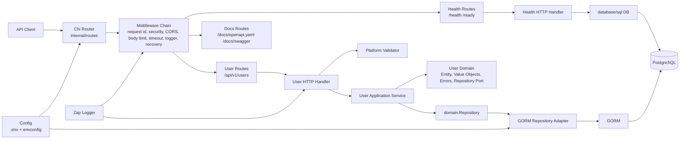
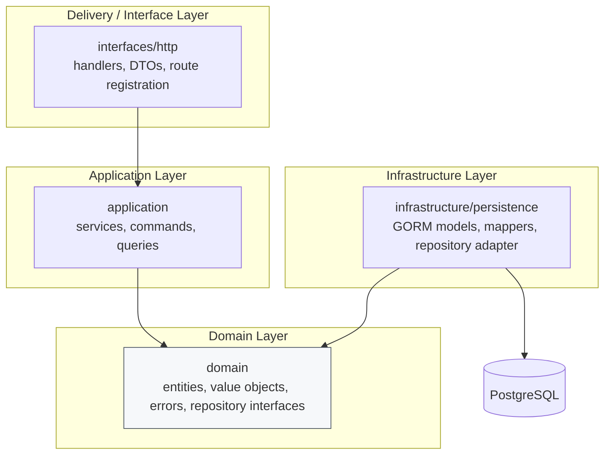
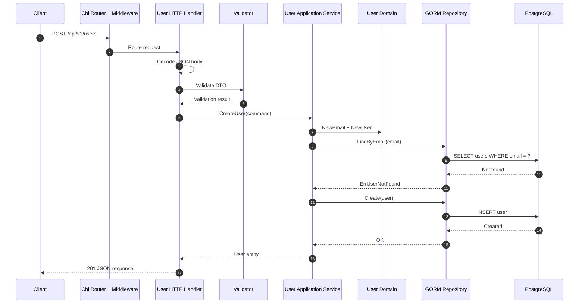
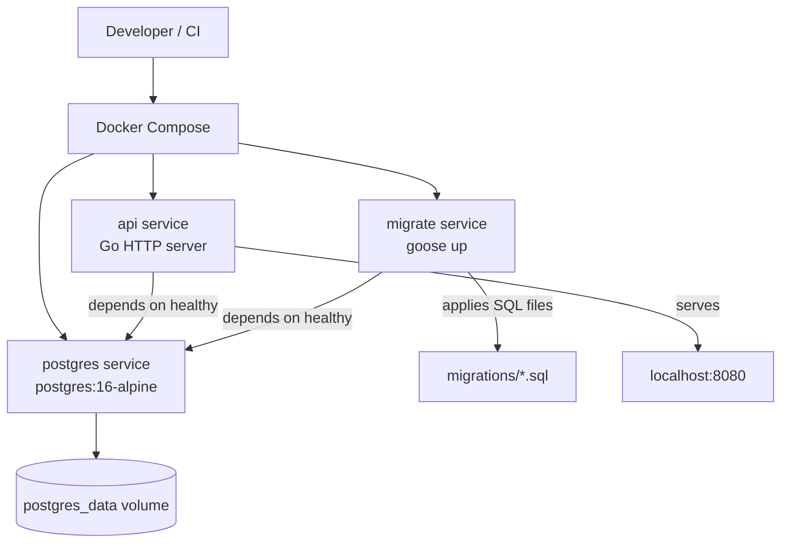

# Go DDD Boilerplate

> **Go version:** This boilerplate targets Go 1.25 because the selected dependency/toolchain set requires Go 1.25 or newer. Docker Compose builds with `golang:1.25-alpine` by default.

A production-minded Go REST API boilerplate using Chi, GORM, PostgreSQL, envconfig, Zap, goose, OpenAPI, Docker Compose, golangci-lint, pre-commit, GitHub Actions, `httptest`, and testcontainers.

This project is organized around Domain-Driven Design (DDD) boundaries: HTTP delivery code lives at the edge, application services orchestrate use cases, domain code owns business rules and contracts, and infrastructure implements external concerns such as persistence.

## Quick start

```bash
cp .env.example .env
go mod tidy
make docker-init
curl http://localhost:8080/health
```

The API is now running at `http://localhost:8080`. Visit `http://localhost:8080/docs/swagger` for the interactive API docs.

## Table of contents

- [Project architecture](#project-architecture)
- [Runtime architecture](#runtime-architecture)
- [DDD layer dependencies](#ddd-layer-dependencies)
- [Request lifecycle](#request-lifecycle)
- [Docker architecture](#docker-architecture)
- [Repository layout](#repository-layout)
- [Stack](#stack)
- [First run with Docker](#first-run-with-docker)
- [First run locally](#first-run-locally)
- [API routes](#api-routes)
- [Configuration](#configuration)
- [Migrations](#migrations)
- [Testing and verification](#testing-and-verification)
- [Adding a new module](#adding-a-new-module)
- [Production notes](#production-notes)

## Project architecture

```text
cmd/api                application entrypoint
internal/app           bootstrap and HTTP server lifecycle
internal/config        typed envconfig configuration and validation
internal/routes        global router, middleware, docs, and module route registration
internal/platform      shared infrastructure utilities
internal/modules       DDD bounded contexts
migrations             goose SQL migrations
docs                   OpenAPI/Swagger assets
scripts                helper scripts
tests                  integration/e2e tests
```

Current bounded contexts:

- `health` exposes readiness and liveness checks.
- `user` demonstrates a complete CRUD module with HTTP handlers, DTOs, application commands/queries, domain entities/value objects, repository contracts, and GORM persistence.

## Runtime architecture



## DDD layer dependencies

The dependency rule is intentionally one-way: outer layers depend on inner layers, while domain code stays independent of frameworks and infrastructure.



Dependency direction:

```text
interfaces/http -> application -> domain
infrastructure  -> domain
```

The domain layer should not import Chi, GORM, Zap, validators, PostgreSQL drivers, or HTTP packages.

## Request lifecycle

Example: `POST /api/v1/users`



## Docker architecture



`make docker-init` starts PostgreSQL, waits for the database health check, runs goose migrations in a one-shot migration container, then starts the API.

## Repository layout

```text
.
├── .github/workflows/              # CI workflows
├── cmd/
│   └── api/
│       └── main.go                 # config, logger, DB connection, bootstrap, serve
├── docs/
│   └── openapi.yaml                # OpenAPI specification served by the API
├── internal/
│   ├── app/
│   │   ├── bootstrap.go            # wires dependencies and builds the router
│   │   └── server.go               # HTTP server and graceful shutdown
│   ├── config/
│   │   └── config.go               # typed environment configuration
│   ├── routes/
│   │   └── routes.go               # global router, middleware, docs, module routes
│   ├── platform/
│   │   ├── database/               # PostgreSQL/GORM connection helpers
│   │   ├── httperror/              # shared HTTP error helpers
│   │   ├── logger/                 # Zap logger factory
│   │   ├── middleware/             # request middleware
│   │   ├── response/               # response envelope and pagination helpers
│   │   └── validator/              # validation adapter
│   └── modules/
│       ├── health/
│       │   └── interfaces/http/     # health and readiness handlers/routes
│       └── user/
│           ├── application/         # use cases, commands, queries
│           ├── domain/              # entity, value objects, errors, repository port
│           ├── infrastructure/
│           │   └── persistence/     # GORM model, mapper, repository adapter
│           └── interfaces/http/     # handlers, DTOs, HTTP routes, handler tests
├── migrations/                      # goose SQL migrations
├── scripts/                         # helper scripts
├── tests/integration/               # testcontainers-based integration tests
├── Dockerfile                       # multi-stage build
├── docker-compose.yml               # API, Postgres, migration service
├── Makefile                         # local/dev/CI commands
└── README.md
```

## Stack

```text
Language:      Go
Router:        Chi
ORM:           GORM
Database:      PostgreSQL
Validation:    go-playground/validator
Config:        envconfig + optional .env loading
Logger:        zap
Migrations:    goose
Docs:          Swagger/OpenAPI
Lint:          golangci-lint
Pre-commit:    pre-commit
Docker:        Docker + Docker Compose
CI:            GitHub Actions
Testing:       go test + httptest + testcontainers
```

## First run with Docker

```bash
cp .env.example .env
go mod tidy
make docker-init
curl http://localhost:8080/health
curl http://localhost:8080/ready
```

Useful Docker commands:

```bash
make docker-up              # start API + Postgres
make docker-migrate-up      # apply migrations
make docker-migrate-status  # show migration status
make docker-logs            # follow logs
make docker-down            # stop services
```

## First run locally

```bash
cp .env.example .env
go mod tidy
make install-tools
make docker-up              # starts Postgres and API; use Ctrl+C if foreground is preferred
make migrate-up             # local goose command against localhost Postgres
make run
```

## API routes

```text
GET     /
GET     /health
GET     /ready
GET     /docs/openapi.yaml
GET     /docs/swagger
GET     /api/v1/users
POST    /api/v1/users
GET     /api/v1/users/{id}
PUT     /api/v1/users/{id}
DELETE  /api/v1/users/{id}
```

Example request:

```bash
curl -X POST http://localhost:8080/api/v1/users \
  -H 'Content-Type: application/json' \
  -d '{"name":"Ada Lovelace","email":"ada@example.com"}'
```

List users with pagination, search, and sorting:

```bash
curl 'http://localhost:8080/api/v1/users?page=1&limit=10&search=ada&sort=created_at&order=desc'
```

## Configuration

Configuration is loaded from environment variables, with optional `.env` loading for local development.

Common variables:

```text
APP_NAME
APP_ENV
APP_PORT
APP_DEBUG
LOG_LEVEL
CORS_ALLOWED_ORIGINS
CORS_ALLOWED_METHODS
CORS_ALLOWED_HEADERS
REQUEST_TIMEOUT_SECONDS
SHUTDOWN_TIMEOUT_SECONDS
HTTP_READ_TIMEOUT_SECONDS
HTTP_WRITE_TIMEOUT_SECONDS
HTTP_IDLE_TIMEOUT_SECONDS
MAX_BODY_BYTES
DB_HOST
DB_PORT
DB_USER
DB_PASSWORD
DB_NAME
DB_SSL_MODE
DB_TIMEZONE
DB_MAX_IDLE_CONNS
DB_MAX_OPEN_CONNS
DB_MAX_LIFETIME_SECONDS
```

## Migrations

SQL migrations live in `migrations/` and are applied with goose.

```bash
make migrate-up
make migrate-down
make migrate-status
```

For Docker-based development:

```bash
make docker-migrate-up
make docker-migrate-status
```

## Testing and verification

```bash
make verify
make test-integration
```

`make verify` runs formatting, module tidy checks, linting, unit/handler tests, and build verification. Integration tests require Docker because they use testcontainers.

## Adding a new module

Use the existing `internal/modules/user` module as the template for a new bounded context.

```mermaid
flowchart LR
    Domain["1. Define domain\nentity, value objects, errors, repository interface"] --> Application["2. Add application use cases\ncommands, queries, service"]
    Application --> Infrastructure["3. Implement infrastructure\nGORM model, mapper, repository"]
    Infrastructure --> Interface["4. Add interface layer\nDTOs, handlers, routes"]
    Interface --> Bootstrap["5. Wire dependencies\ninternal/app/bootstrap.go"]
    Bootstrap --> Router["6. Register routes\ninternal/routes or module routes"]
    Router --> Docs["7. Update OpenAPI docs\ndocs/openapi.yaml"]
    Docs --> Tests["8. Add unit, handler, and integration tests"]
```



Recommended module shape:

```text
internal/modules/<module>/
├── application/
│   ├── commands/
│   ├── queries/
│   └── service.go
├── domain/
│   ├── entity.go
│   ├── errors.go
│   ├── repository.go
│   └── value_objects.go
├── infrastructure/
│   └── persistence/
│       ├── gorm_model.go
│       ├── mapper.go
│       └── repository.go
└── interfaces/
    └── http/
        ├── dto/
        ├── handler.go
        └── routes.go
```

## Production notes

Before deploying:

- Replace default credentials.
- Set `APP_ENV=production`.
- Set restrictive `CORS_ALLOWED_ORIGINS` values.
- Use managed secrets instead of committing `.env` files.
- Run migrations as a controlled release step.
- Review Docker and runtime hardening settings for your target platform.

The included Docker image uses multi-stage builds. Docker Compose configures health checks, a named PostgreSQL volume, read-only filesystem settings for the API service, dropped Linux capabilities, and `no-new-privileges`.

## Template adoption notes

The current module path is `github.com/your-org/go-ddd-boilerplate`. When using this as a starting point for a real project, update the module path and imports to your target repository path.

### Docker Go version note

This project requires Go 1.25. Docker Compose builds with `DOCKER_GO_VERSION=1.25` by default. If an older local `.env` contains `GO_VERSION=1.23`, update it to `GO_VERSION=1.25` or remove that line.
